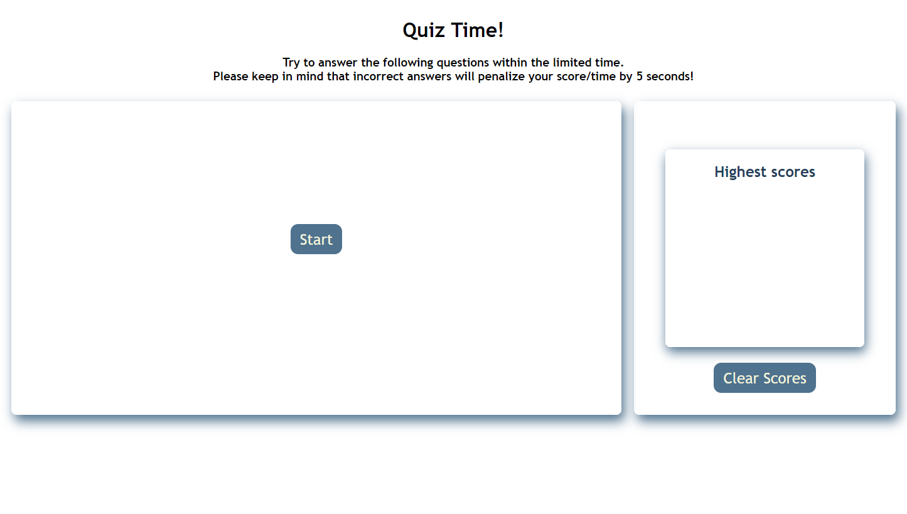

# Quiz application

## This is a timed quiz on Javascript fundamentals that stores high scores.

* There are total 5 questions with 30 seconds for you to answer. 
* Incorrect answer will penalize the final score/time by 5 seconds, and will not move to the next question unitl you hit the correct one.
* The game is over when all questions are answered or the timer reaches 0.
* You can save your initials and score when game is over, and clear the previous data when you hit 'Clear Scores' button.

## Have fun and enjoy!

### App link https://sherryzheng2018.github.io/quiz-app/.

